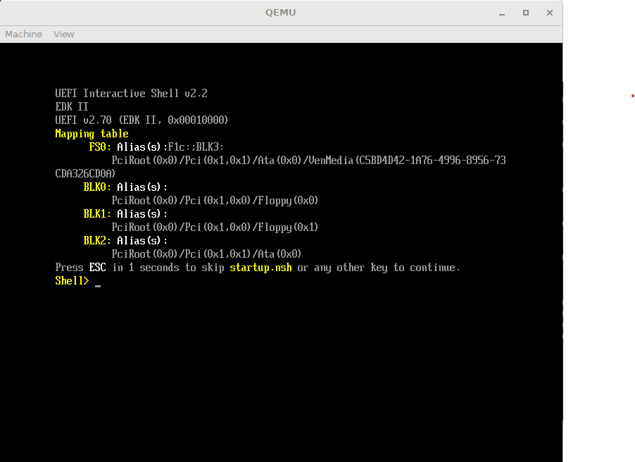

# What is Project Turtle?
Project Turtle is a UEFI application written in NASM assembly for x86 (e.g. Intel and AMD) computers.

## What is the goal?
The goal is to create a UEFI application to read images off a drive and display them on a screen, like an electronic advertising sign.
However, using this program would bypass an operating system entirely, completely removing lots of the complexity and possible issues that could come from underlying software (e.g. Windows).
It would also make for an extremely light-weight purpose-built system.

## How close is it to the goal?
Not very far. Currently, the program can detect currently installed protocols.
It can also print strings and numbers.

The next step is to get it to read from the file system.

# How do I run Project Turtle?
There are three basic steps:
1. Install prerequisites
2. Build the application binary
3. Run the binary

## Install Prerequisites
You will need to install NASM (nasm.us) to compile the code.

### Prerequisites for QEMU
This program can be built as an image that works on QEMU.
I have tested many image burning software, and ImgBurn (www.imgburn.com) is the only software that creates a suitable image for QEMU.
If you can make another image burning software work, please let me know how you did it!

You will also need UEFI firmware for QEMU called OVMF.FD. I have included a suitable firmware file if you don't have one.

## Build the Application Binary
To build the application, you will need to compile the code using NASM:

	nasm -f bin kernal.asm -o BOOTX64.efi

This will produce a BOOTX64.efi file in your workspace. This is the UEFI application binary.

## Running the application binary
Two methods have been tested. If you have tested another method, please let me know so I can include it here!
- Running the binary off a bootable drive
- Running the binary in QEMU

### Running the binary off a bootable drive
UEFI will look for a binary in the **/EFI/BOOT** directory. So, you need to create the folder on your device, and then put the BOOTX64.EFI file there.
For example, you can use the following code snippet in your command prompt. Replace *drive* with the drive letter of the device you're using:

	del "*drive*\EFI\BOOT\BOOTX64.efi"
	xcopy /y BOOTX64.efi "*drive*\EFI\BOOT"

Then, plug the USB into the target device and enter the BIOS boot menu.
Select the USB UEFI partition in the BIOS boot menu and the program will start.
The method of accessing the BIOS boot menu depends on the particular device.
	
### Running the binary in QEMU
There are multiple steps to creating an image for QEMU:
1. Create a drive structure
2. Make an ISO image based on the drive structure
3. Launch QEMU with the OVMF firmware and the ISO image
4. Run the image in QEMU

#### Create a drive structure
The ISO image must contain the full path /EFI/BOOT/BOOTX64.efi (or whatever you choose to call your EFI file).
Therefore, you need to create a local folder to store the contents of your ISO file.
For example, you can use the following code snippet in your command prompt. Replace *drive* with the name of the folder holding the /EFI subfolder:

	del "*drive*\EFI\BOOT\BOOTX64.efi"
	xcopy /y BOOTX64.efi "*drive*\EFI\BOOT"
	
This will generate a folder which contains the drive structure. This will be converted into an image file in the next step.
	
#### Make an ISO image based on the drive structure
Use ImgBurn to build the image. Replace *drive* with the name of the folder holding the /EFI subfolder and *name* with the name of your ISO file (can be anything):

	"C:\Program Files (x86)\ImgBurn\ImgBurn.exe" /MODE BUILD /BUILDINPUTMODE STANDARD /BUILDOUTPUTMODE IMAGEFILE /SRC *drive* /DEST UEFI.ISO /VOLUMELABEL *name* /OVERWRITE YES /START /CLOSESUCCESS /NOIMAGEDETAILS /NOSAVESETTINGS /ROOTFOLDER YES

This command will generate a *name*.ISO file in the folder you ran the command in. This is what QEMU will run.
	
#### Launch QEMU with the OVMF firmware and the ISO image
Launch QEMU with the following specifications. Replace *name* with the name of your ISO file.
If your OVMF firmware file is called something other than OVMF.fd, you need to replace OVMF.fd with the name of your firmware file too.
	"C:\Program Files\qemu\qemu-system-x86_64.exe" -cdrom UEFI.ISO -cpu qemu64 -pflash OVMF.fd -L "C:\Program Files\qemu" -net none -monitor stdio
	
#### Run the image in QEMU
(this part may be slightly different based on the firmware image you use).

When QEMU starts up, you will be greeted with a screen containing a mapping table.

From here, you need to navigate to the BOOTX64.efi file and run it. Commands are:

	FS0:
	cd \EFI\BOOT
	BOOTX64.efi
	
And you should be able to see the output!
If it finishes with "That's all for now", then the program ran successfully!

# How can I raise issues with Project Turtle?
You can add an issue in GitHub and I will look into it.

# How can I contribute to Project Turtle?
You can contribute by sending a Pull Request in GitHub.
I welcome all helpful contributions!

# Can I use your code in my project?
Absolutely! Please do!
Just remember to include the MIT license in your code if you use a substantial portion of this software in your project (per the license agreement).
